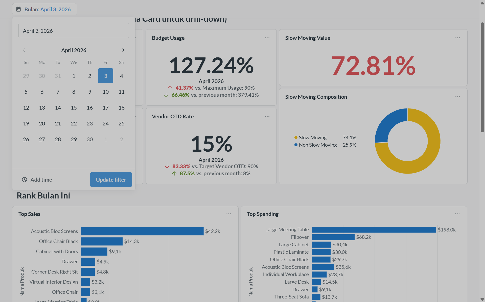

# KBA_Kelompok_7
Proyek Business Intelligence Kelompok 7 KBA_SI-F

### KPI
1. **Sales Achievement Rate**: Mencapai 100% target penjualan bulanan sesuai dokumen target penjualan (CSV). 
2. **Sales Conversion Rate**: Mencapai rasio konversi penawaran menjadi pesanan (Quotation to Sales Order) minimal 70%.
3. **Vendor On-Time Delivery**: Jumlah pengiriman tepat waktu dari vendor mencapai 90% dari total pengiriman untuk tiap bulan.
4. **Budget Adherence**: Pengeluaran pembelian bulanan perusahaan tidak melebihi 90% dari alokasi di dokumen anggaran (XLSX).
5. **Slow Moving Optimization**: Menjaga komposisi stok barang "Slow Moving" maksimal 25% dari total nilai stok.

## Penyiapan Repository Proyek
### Clone Repository
Pastikan perangkat sudah memiliki ini:
- **Git:** Git terinstall di perangkat. Git bisa didownload dari official Git website.
- **Terminal:** Command-line interface (Terminal di macOS/Linux, Command Prompt atau Git Bash di Windows) untuk mengeksekusi perintah clone.

Jalankan kode berikut untuk melakukan clone repository.
```bash
git clone https://github.com/bimaganteng99/KBA_Kelompok_7.git
```

Bersihkan container proyek jika sebelumnya sudah menjalankan `docker compose up` agar container kembali bersih:
```bash
docker compose down -v
```

### Buat file .env
Buat file `.env`, lalu salin isi file `.env.example` ke dalamnya.

## OPSI 1: Jalankan Seluruh Pipeline & Automasi

Proyek ini sudah memiliki **automasi** menggunakan Python Scheduler `main.py` untuk menjalankan seluruh pipeline mulai dari ingestion hingga dashboard yang sudah jadi. 

Anda cukup menjalankan satu baris kode berikut:
```bash
docker compose up -d && docker compose logs -f python_etl
``` 
Kode tersebut akan membangun seluruh arsitektur data dan menampilkan log dari Python Scheduler/Python ETL secara real-time.

### Akses Odoo
Buka Odoo di [localhost:8069](http://localhost:8069/web/login). Login dengan menggunakan kredensial berikut:
```
email    : admin@kba7.com 
password : adminkba7
```
Modul Purchase, Inventory, dan Sales sudah terpasang dan berisi data, siap untuk digunakan.

### Akses Metabase
Buka Metabase di [localhost:3000](localhost:3000), lalu login dengan kredensial berikut:
```
email: admin@kba7.com
password: adminkba7
```
Grafik dan dashboard yang kami buat tersedia di "Your Personal Collection" atau "KBA7byMZ" di panel samping. Anda bisa membuka dashboard utama **`dashboard_bi_kba7`** di dalam collection untuk melihat dashboard yang telah kami buat.

### Catatan
Untuk menghentikan Python Scheduler, anda dapat menjalankan kode berikut:
```bash
docker compose stop python_etl
```

## OPSI 2: Bangun Arsitektur Secara Bertahap

Berikut adalah panduan untuk menjalankan proyek kami secara manual dan bertahap. Kami akan menjelaskan detail proses arsitektur kami di sini.

### Compose Postgres & Clickhouse
Kedua komponen ini adalah pondasi proyek kami. Tanpa kedua komponen ini, Odoo tidak akan bisa menyala.

Pastikan repositori sudah di-clone dan container proyek bersih. Jika sebelumnya sudah pernah menjalankan `docker compose up`, bersihkan proyek dengan menjalankan `compose down` seperti pada instruksi di atas. 

Buat file `.env` dan bangun container postgres dan clickhouse dengan menjalankan kode berikut:
```bash
# salin isi file .env.example ke file .env
copy .env.example .env

# jalankan compose up
docker compose up -d postgres clickhouse
```
Periksa status postgres dan clickhouse, pastikan status kedua komponen healthy:
```bash
docker ps
```

---

### Compose Odoo
Jalankan kode berikut:
```bash
docker compose up -d odoo
docker ps
```
Pastikan semua service berstatus healthy.
Buka Odoo di [localhost:8069](http://localhost:8069/web/login?db=odoo)

Login dengan menggunakan kredensial berikut:
```text
database : odoo
email    : admin@kba7.com 
password : adminkba7
```
Jika instalasi berhasil, modul Purchase, Inventory, dan Sales sudah terpasang dan berisi data.

---

### Persiapan Environment Python
Setelah Odoo berjalan dan berisi data, langkah selanjutnya adalah menarik data tersebut ke Data Warehouse (ClickHouse) dan membersihkannya menggunakan arsitektur Medallion.

Proyek ini menggunakan Python untuk ekstraksi data dan `dbt` untuk transformasi. Pastikan kamu menggunakan Virtual Environment.

Jalankan perintah berikut di terminal:
```bash
# Membuat environment variable
python -m venv env

# Mengaktifkan virtual environment (Windows)
.\env\Scripts\activate

# Instalasi library utama
pip install -r requirements.txt

# FIX PENTING untuk pengguna Python 3.14+ (Mengatasi error mashumaro pada dbt)
pip install "mashumaro[msgpack]>=3.17"
```

---

### Ingestion (Bronze)
Skrip Python digunakan untuk menyedot data dari PostgreSQL (Odoo) dan file manual (CSV/XLSX), lalu memasukkannya ke layer `kba_bronze` di ClickHouse dengan format teks murni (String) menggunakan metode *Full Load*.

Pastikan file `target_sales_simple.csv` dan `budget_purchase_furniture.xlsx` sudah berada di dalam folder `data/raw/`.

Jalankan skrip ekstraksi:
```bash
python scripts_python/extract_to_bronze.py
```
*Tanda sukses: Muncul indikator "Data ... berhasil masuk!" untuk 15 tabel.*

---

### Transformasi & Cleaning (Silver)
Setelah data mentah masuk ke Bronze, kami menggunakan **dbt (data build tool)** untuk membersihkan data tersebut ke layer `kba_silver`. Proses ini meliputi:
- Konversi tipe data (String menjadi Int, Float, atau Date).
- Penanganan nilai kosong/Null.

Selain itu, untuk analisis pergerakan barang berdasarkan transaksi **outgoing** (barang keluar/terjual), kami membangun tabel fitur **`kba_silver.silver_fitur_movement_bulanan`** yang berisi fitur *per-produk-per-bulan* yang akan digunakan sebagai input analisis KPI dan clustering.

Tabel yang dihasilkan pada Layer Silver:
- `silver_sales` (dari Odoo)
- `silver_purchase` (dari Odoo)
- `silver_purchase_detail` (dari Odoo)
- `silver_inventory` (dari Odoo)
- `silver_products` (dari Odoo)
- `silver_purchase_on_time` (dari Odoo)
- `silver_sale_order_line` (dari Odoo)
- `silver_sales_move` (dari Odoo)
- `silver_stock_move_line` (dari Odoo)
- `silver_stock_picking` (dari Odoo)
- `silver_stock_picking_type` (dari Odoo)
- `silver_stock_move` (dari Odoo)
- `silver_stock_valuation` (dari Odoo)
- `silver_fitur_movement_bulanan` (dari Odoo)
- `silver_stock_value` (dari Odoo)
- `silver_target_penjualan` (dari CSV)
- `silver_alokasi_anggaran` (dari Excel)

Masuk ke direktori dbt dan jalankan proses transformasi:
```bash
# Pindah ke folder dbt
cd etl_kba

# Jalankan model dbt untuk model silver (menggunakan dbt_project.yml dan profiles.yml di folder saat ini)
dbt run --profiles-dir . --select tag:silver
```
*Tanda sukses: Muncul keterangan `Completed successfully` dan `PASS=17` di terminal.*

---

### Data Quality Test (1/2)

Meliputi pemeriksaan `null` untuk kolom-kolom yang krusial untuk perhitungan KPI, seperti `id` dan `price`, serta pemeriksaan unique value untuk `id`. Jalankan kode berikut untuk melakukan pemeriksaan kualitas data tahap 1:
```bash
# jalankan pemeriksaan tahap 1
dbt test --profiles-dir . --select silver --exclude source:external_python
```
Jika hasil menunjukkan `Pass=61`, maka seluruh test berhasil terpenuhi dan data layak untuk diproses di tahap selanjutnya.

### Slow Moving & Clustering Produk (Silver)

Untuk kebutuhan KPI operasional, kami menerapkan definisi slow moving secara **absolut**. Produk dinyatakan **slow moving** jika:
- `jeda_hari_dari_transaksi_terakhir >= 30`, **atau**
- `total_qty_terjual_keluar < 10`

Kemudian, kami menggunakan **KMeans Clustering** untuk melakukan **segmentasi pola transaksi produk** yang bersifat relatif. Output KPI dan hasil segmentasi disimpan dalam tabel yang sama, yaitu **`kba_silver.silver_slow_moving_bulanan`**.

Interpretasi cluster/segmen:
- `frequent_small`  → sering transaksi, qty per transaksi kecil (memiliki pola ritel)
- `rare_bulk`       → jarang transaksi, namun qty besar (memiliki pola grosir)
- `balanced_regular`→ pola transaksi dan volume stabil/menengah

> **KPI Slow Moving** digunakan untuk penilaian performa dan pelaporan karena definisinya absolut dan tidak harus selalu ada slow moving. **KMeans** digunakan untuk segmentasi/insight (seperti strategi replenishment dan interpretasi perilaku transaksi), bukan sebagai definisi KPI.

Untuk memulai proses analitik KMeans Clustering, jalankan kode berikut di root proyek:
```bash
# pindah ke root proyek
cd ..

# jalankan script clustering
python scripts_python/kmeans_cluster_movement_bulanan.py
```
Setelah proses selesai, akan tampil ringkasan KPI dan ringkasan segment di terminal. Output dari proses ini dapat dilihat di Clickhouse pada tabel **`kba_silver.silver_slow_moving_bulanan`**

### Data Quality Test (2/2)

Memastikan `is_slow_moving_kpi` dan `demand_segment` lolos pemeriksaan accepted value. Jalankan kode berikut:
```bash
# Pindah ke folder dbt
cd etl_kba

# jalankan pemeriksaan tahap 2
dbt test --select source:external_python.silver_slow_moving_bulanan
```
Setelah hasil menunjukkan `Pass=2` pemrosesan gold layer sudah dapat dilakukan.

### Data Marts (Gold)

Data dari Silver Layer diagregasi untuk membentuk Data Marts, yaitu tabel-tabel siap pakai untuk visualisasi data sesuai KPI yang telah didefinsiikan. Jalankan kode berikut:
```bash
dbt run --select gold 
```
Jika hasil menunjukkan `Pass=7`, maka proses telah selesai dan tabel hasil pemrosesan dapat dilihat pada `kba_gold` di Clickhouse.

### Compose Metabase

Jalankan kode berikut:
```bash
docker compose up -d metabase --wait
docker ps
```
Pastikan semua komponen berstatus `healthy`.

Dashboard ini telah dikonfigurasi secara otomatis sehingga tidak perlu melakukan setup database secara manual. Buka [localhost:3000](localhost:3000) setelah semua container dipastikan berjalan. Gunakan kredensial berikut:
```
email: admin@kba7.com 
password: adminkba7
```
Pilih collection `KBAbyMZ` pada sidebar sebelah kiri untuk melihat dashboard dan grafik yang telah tersedia. Buka file `dashboard_bikba7` untuk membuka dashboard utamanya. Semua grafik, filter, dan drill-down telah tersedia dan siap digunakan.



### Opsional : Automasi Pipeline
Sistem ini menggunakan Python Scheduler (`main.py`) untuk mengotomatisasi seluruh alur data dari Odoo hingga menjadi dashboard di Metabase.

### Mekanisme Kerja Scheduler
Scheduler bekerja dengan metode CDC (Change Data Capture) sederhana berbasis `MAX(id)`. Setiap **`20 detik`**, script akan melakukan pengecekan silang antara database sumber dan warehouse:
- Pengecekan Postgres: Mengambil `MAX(id)` terbaru dari tabel-tabel utama Odoo (seperti `sale_order`).
- Pengecekan ClickHouse: Mengambil `MAX(id)` yang sudah tersimpan di layer Bronze.
- Trigger Pipeline: Jika `MAX(id)` Postgres > `MAX(id)` ClickHouse, maka seluruh pipeline (`Ingestion -> dbt Silver -> K-Means -> dbt Gold`) akan dijalankan secara berurutan.

### Spesifikasi Environment
Pipeline ini berjalan di dalam container Docker (`trialproyek_etl_runner`) dengan dependensi berikut:

| Komponen | Spesifikasi |
| :--- | :--- |
| **Runtime** | Python 3.10-slim |
| **Driver DB** | `psycopg2-binary` (Postgres), `clickhouse-driver` |
| **Orkestrasi Data** | `dbt-core` 1.11.8 & `dbt-clickhouse` |
| **Analitik** | `scikit-learn` (K-Means Clustering) |

### Cara Menjalankan
Pastikan environment variables di file `.env` sudah benar, lalu jalankan container:  
```bash
# jalankan python etl
docker compose up -d python_etl

# pantau log python etl
docker logs -f trialproyek_etl_runner
```
Jalankan kode berikut jika ingin menghentikan Python Scheduler:
```bash
docker compose stop python_etl
```

## Catatan Troubleshooting
- **Conflict Port 5432:** Jika ada PostgreSQL bawaan yang berjalan di laptop, koneksi ke Odoo dari luar Docker diubah menggunakan port `5433` (seperti yang terkonfigurasi di `docker-compose.yml` dan `extract_to_bronze.py`).
- **Akses DBeaver/Terminal ClickHouse:** Gunakan port `8123` untuk DBeaver atau jalankan `docker exec -it trialproyek_clickhouse clickhouse-client` untuk masuk langsung via terminal.

---
